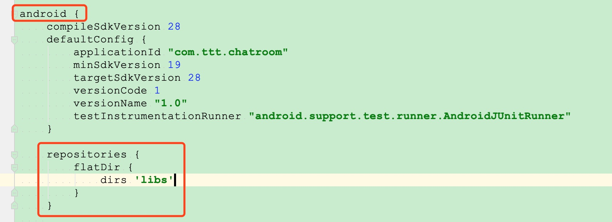
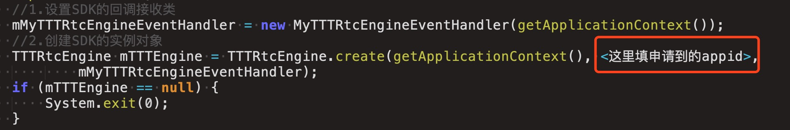

# 主播跨房间PK
在社交娱乐等业务场景中，为了增强趣味性和互动性，经常会设计一些主播PK的互动场景，将不同房间的主播拉入同一个房间内进行游戏互动，同时各主播原有房间的观众还能同时观看到自己关注的主播表演并进行打赏等互动。

## 典型场景
主播A和主播B分别创建2个直播房间，房间内无连麦副播，直接将房间内的主播画面推流到CDN进行直播。当主播A向主播B发出PK邀请，主播A所在的房间将拉取一路B主播的流进入A房间进行实时PK互动，主播B所在的房间将拉取一路A主播的流进入B房间进行实时PK互动，同时通过后台的混频转码服务将2个主播的音视频数据进行合成后推送到原先的CDN地址。各自的CDN观众看到两个主播开始 PK。由于两个主播各自的 CDN 推流地址未发生改变，CDN 观众端不需要切换 CDN 拉流地址。当PK活动结束后，各自房间停止拉对方的流，即可恢复原来的直播模式。

# 架构设计
 

# 功能列表

1. 创建 TTT 音视频引擎对象 [create](http://www.3ttech.cn/index.php?menu=72&type=Android#create)
2. 启用视频模块功能 [enableVideo](http://www.3ttech.cn/index.php?menu=72&type=Android#enableVideo)
3. 设置频道模式，PK 场景下频道模式需要设定为直播模式 [setChannelProfile](http://www.3ttech.cn/index.php?menu=72&type=Android#setChannelProfile)
4. 设置用户角色，PK 场景下需要角色设定为主播 [setClientRole](http://www.3ttech.cn/index.php?menu=72&type=Android#setClientRole) 
5. 设置 SDK 的 CDN 推流地址 [configPublisher](http://www.3ttech.cn/index.php?menu=72&type=Android#configPublisher) 
6. 加入频道 [joinChannel](http://www.3ttech.cn/index.php?menu=72&type=Android#joinChannel)
7. 创建视频显示控件 [CreateRendererView](http://www.3ttech.cn/index.php?menu=72&type=Android#CreateRendererView)
8. 配置视频显示控件 [setupLocalVideo](http://www.3ttech.cn/index.php?menu=72&type=Android#setupLocalVideo)
9. 打开本地视频预览 [startPreview](http://www.3ttech.cn/index.php?menu=72&type=Android#startPreview)
10. 发起 PK [subscribeOtherChannel](http://www.3ttech.cn/index.php?menu=72&type=Android#subscribeOtherChannel) 
11. 配置远端用户视频显示控件 [setupRemoteVideo](http://www.3ttech.cn/index.php?menu=72&type=Android#setupRemoteVideo) 
12. 设置其他主播在 CDN 视频流中显示位置 [setVideoCompositingLayout](http://www.3ttech.cn/index.php?menu=72&type=Android#setVideoCompositingLayout)
13. 结束 PK [unSubscribeOtherChannel](http://www.3ttech.cn/index.php?menu=72&type=Android#unSubscribeOtherChannel)
14. 离开频道 [leaveChannel](http://www.3ttech.cn/index.php?menu=72&type=Android#leaveChannel)

### 可选操作
1. 启用说话音量提示，可选操作 [enableAudioVolumeIndication](http://www.3ttech.cn/index.php?menu=72&type=Android#enableAudioVolumeIndication)
2. 设置本地视频质量等级，可选操作，默认 360P [setVideoProfile](http://www.3ttech.cn/index.php?menu=72&type=Android#setVideoProfile)
3. 切换摄像头 [switchCamera](http://www.3ttech.cn/index.php?menu=72&type=Android#switchCamera)
4. 静音/取消静音 [muteLocalAudioStream](http://www.3ttech.cn/index.php?menu=72&type=Android#muteLocalAudioStream)

### 实现细节
* PK 模式下，双方主播的 CDN 推流地址应与普通模式时选用的 URL 地址是一致的，确保 CDN 观众无需切换 CDN 地址。
* PK 模式下，若要结束 PK 模式，每个主播都调用 [unSubscribeOtherChannel](http://www.3ttech.cn/index.php?menu=72&type=Android#unSubscribeOtherChannel) 接口。例如 A 和 B 主播进行 PK，结束 PK 时 A 和 B 主播都需要调用。若只有一方调用，则另一方没有调用，没有调用接口的一方视频会继续接收，但音频会停止接收，状态就会不对。

# 示例程序

#### 准备工作
1. 在三体云官网SDK下载页 [http://3ttech.cn/index.php?menu=53](http://3ttech.cn/index.php?menu=53) 下载对应平台的 连麦直播SDK。
2. 登录三体云官网 [http://dashboard.3ttech.cn/index/login](http://dashboard.3ttech.cn/index/login) 注册体验账号，进入控制台新建自己的应用并获取APPID。

#### Android

1. 解压下载的 SDK 压缩包，内容如图所示

2. 用Android Studio，打开**Android-PK** Demo工程，文件列表如图所示，复制**3T\_Native\_SDK\_for\_Android\_Vx.x.x\_Full.aar** 到工程 **app** 项目下的 **libs** 目录下。
 
 
 
3. 引用aar包。在app项目下的build.gradle文件中添加红框中相应代码来引用。
 
 
 

4. 将申请到的**APPID**填入 SDK 的初始化函数 create 中，如下图所示。

5. 最后编码代码即可运行Demo。

	运行环境:
    * Android Studio 3.0 +
    * minSdkVersion 16
    * gradle 4.6
    * java 7.0

	Android权限要求:
	
	  * **android.permission.CAMERA** ---> SDK视频模块需要使用此权限用来访问相机，用于获取本地视频数据。
     * **android.permission.RECORD_AUDIO** ---> SDK音频模块需要使用此权限用来访问麦克风，用于获取本地音频数据。
     * **android.permission.INTERNET** ---> SDK的直播和通讯功能，均需要使用网络进行上传。
     * **android.permission.BLUETOOTH** ---> SDK的直播和通讯功能，均需要访问蓝牙权限，保证用户能正常使用蓝牙耳机。
     * **android.permission.BLUETOOTH_ADMIN** ---> 蓝牙权限。
     * **android.permission.MODIFY\_AUDIO\_SETTINGS** ---> SDK的直播和通讯功能，均需要访问音频路由，保证能正常切换听筒，扬声器，耳机等路由切换。
     * **android.permission.ACCESS\_NETWORK\_STATE** ---> SDK的直播和通讯功能，均需要访问网络状态。
     * **android.permission.READ\_PHONE\_STATE** ---> SDK的直播和通讯功能，均需要访问手机通话状态。

# 常见问题
1. 由于部分模拟器会存在功能缺失或者性能问题，所以 SDK 不支持模拟器的使用。

2. 主播PK模式下，不建议在房间内有副播的情况下进行，因为房间原有的副播也能与新进入的主播进行音视频互动，可能影响主播间的PK效果。
